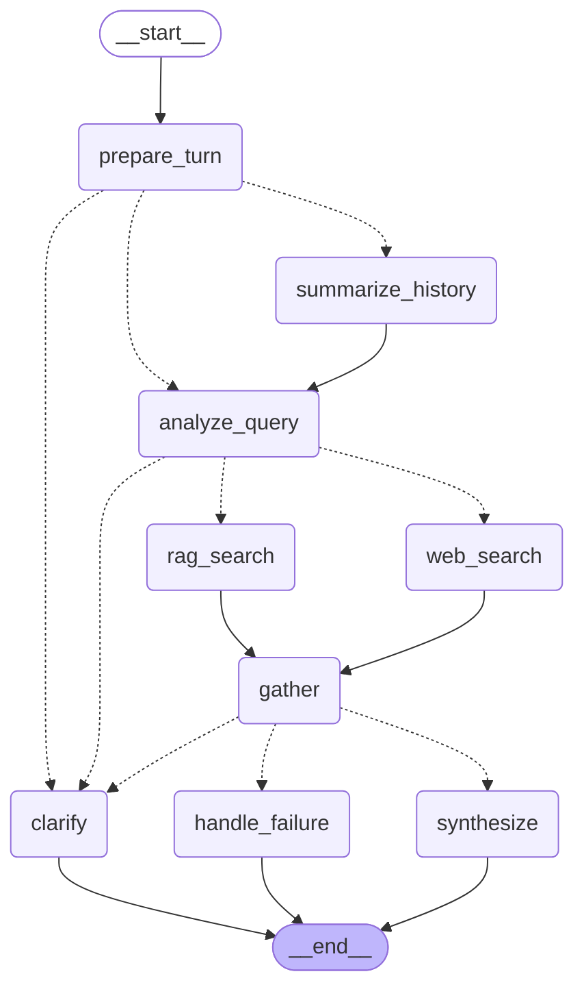

# Agentic RAG — local setup

An agentic RAG system orchestrated with LangGraph. Given a question it decides
which tools it needs, calls them (in parallel when more than one applies),
merges the evidence, and answers with numbered citations.

Everything AWS-facing is simulated so the system runs offline with no
credentials. The swap points for Bedrock and OpenSearch are marked with `TODO`
in the code.

## Requirements

- Python 3.11 or newer (the checked-in `.venv` uses 3.14)
- No AWS credentials needed — the retriever and web search are simulated

## Setup

The virtual environment is already in `.venv`:

```bash
source .venv/bin/activate
```

To build it from scratch:

```bash
python3 -m venv .venv
source .venv/bin/activate
pip install -r requirements.txt
```

Configuration is optional — every setting has a default. To override anything,
copy the example file:

```bash
cp .env.example .env
```

Never commit `.env`. Verify the Bedrock model ids in the console before using
real credentials.

## Running it

Ask a single question:

```bash
python -m agent.run "how do we chunk documents?"
```

Start an interactive multi-turn session:

```bash
python -m agent.run
```

Make the conversation survive exit:

```bash
python -m agent.run --checkpointer sqlite --db ./conversations.sqlite --thread alice
```

REPL commands:

| Command | What it does |
| --- | --- |
| `/history` | the stored transcript, reloaded from the checkpoint |
| `/state` | turn index, stored turns, current summary, checkpoint id |
| `/checkpoints` | every checkpoint in the thread, newest first |
| `/rewind <checkpoint_id> <question>` | replay the thread from that point with a different question |
| `/forget` | delete the thread from the store |
| `/metrics` | counters and p50/p95 latency |
| `/health` | probe each tool's backing dependency |
| `/new [thread_id]` | start a fresh thread |
| `/quit` | exit |

### Useful flags

| Command | What it shows |
| --- | --- |
| `python -m agent.run --trace "how do we chunk documents?"` | the per-node trace with timings |
| `python -m agent.run --json "..."` | the raw result, including citations and failures |
| `python -m agent.run --seed 7 "..."` | reproducible retrieval results |
| `python -m agent.run --failure-rate 1.0 "..."` | forces every tool to fail, so you can watch it refuse rather than guess |
| `python -m agent.run --failure-rate 0.4 "..."` | intermittent failures, so you can watch retries and the degraded answer |
| `python -m agent.run --thread alice "..."` | pick a conversation thread id |
| `python -m agent.run --checkpointer sqlite "..."` | persist the conversation to a file |
| `python -m agent.run --db ./conversations.sqlite "..."` | choose where that file lives |

Logs are structured JSON on stderr, the answer goes to stdout, so you can
separate them:

```bash
python -m agent.run "how do we deploy the api?" 2>/dev/null       # answer only
python -m agent.run "how do we deploy the api?" 2>logs.jsonl      # logs to a file
```

### Questions that exercise different paths

```bash
# internal docs only -> rag_search
python -m agent.run --trace "where is our chunking configuration documented?"

# current events -> adds web_search
python -m agent.run --trace "what is the latest Bedrock pricing announced this week?"

# both tools in parallel
python -m agent.run --trace "how do we chunk docs and what is the latest OpenSearch release?"

# too vague -> asks for clarification instead of searching
python -m agent.run "hi"
```

### Checking that state really persists

```bash
# two separate processes, same thread: the second answers as turn 2
python -m agent.run --checkpointer sqlite --db /tmp/c.sqlite --thread demo "how do we chunk documents?"
python -m agent.run --checkpointer sqlite --db /tmp/c.sqlite --thread demo "and how do we embed them?"

# a third process reloads the whole transcript from disk
printf '/state\n/history\n/quit\n' | python -m agent.run --checkpointer sqlite --db /tmp/c.sqlite --thread demo
```

## Tests

```bash
pytest                  # whole suite, no network, no AWS
pytest -v               # per-test names
pytest tests/test_graph.py            # graph behaviour, multi-turn state, time travel
pytest tests/test_persistence.py      # checkpoint durability and degradation
pytest tests/test_memory.py           # window, summarisation, message removal
pytest tests/test_resilience.py       # retry, backoff, circuit breaker
pytest -k "routing or planning"       # tool selection and conditional edges
```

## Architecture



Dotted lines are conditional edges. All routing lives in `agent/routing.py` as
pure synchronous functions over state, so control flow is testable with a plain
dict.

What each node does:

| Node | Responsibility |
| --- | --- |
| `prepare_turn` | read the new question, bump `turn_index`, clear the previous turn's scratch state |
| `summarize_history` | fold old turns into `summary` and drop them from the checkpoint |
| `analyze_query` | pick the tools this question needs and rewrite follow-ups so they stand alone |
| `rag_search` / `web_search` | invoke one tool each; they run concurrently when both are planned |
| `gather` | join the parallel branches and classify the turn as ok, degraded, or failed |
| `synthesize` | number the evidence, render the answer with markers, run the grounding post-check |
| `clarify` / `handle_failure` | the two paths that cannot produce a cited answer |

`route_after_analysis` returns a *list* of node names, which is how LangGraph
fans out: every name runs in the same superstep. The explicit `gather` join
matters — without it, a turn where retrieval succeeded and web search failed
would route to two different nodes at once.

## Layout

| Path | Role |
| --- | --- |
| `agent/graph.py` | node wiring, compilation, and the `ConversationAgent` façade |
| `agent/routing.py` | the three conditional edge functions |
| `agent/state.py` | `AgentState` channels, reducers, evidence models |
| `agent/memory.py` | conversation memory policy: window, summary folding, message removal |
| `agent/persistence.py` | checkpoint backends and the resilience wrapper |
| `agent/nodes/` | one file per node |
| `agent/tools/` | tool contract, resilience, registry, and the two tools |
| `agent/rag/` | the simulated document store: 20-document corpus and a retriever |
| `agent/errors.py` | error taxonomy with `retryable` / `recoverable` flags |
| `agent/observability.py` | structured logging, trace spans, metrics |
| `agent/container.py` | dependency wiring; the single place to swap in real AWS clients |
| `agent/settings.py` | typed settings, validated once at startup |
| `agent/run.py` | CLI and REPL |

Three layers stay independent on purpose: the RAG system does not know about
tools, the tools do not know about LangGraph, and the graph does not know how
retrieval works.

## The simulated RAG system

`agent/rag/` is a standalone document store. It models the shape of the real
thing rather than faking the return value:

- a 20-document corpus in `corpus.py`
- `SimulatedVectorRetriever` samples candidates, scores them with keyword
  affinity plus noise, and returns the best `top_k` (5 by default), so results
  vary between runs the way an ANN index does
- the embedding step goes through `asyncio.to_thread`, because boto3 blocks
- a concurrency semaphore, since every blocking AWS call costs a thread
- an injectable `failure_rate` that raises timeouts and 503s

The tool layer reaches it through the `Retriever` protocol, so replacing it
with a real OpenSearch k-NN client touches only `agent/container.py`.

## State management

`AgentState` separates two categories, which is what makes multi-turn work:

- **Conversation state** survives turns: `messages`, `turn_index`, `summary`.
  The checkpointer persists it per `thread_id`.
- **Turn scratch** is rebuilt every question: `plan`, `chunks`, `web_results`,
  `citations`, `answer`. `prepare_turn` clears it by writing `None`, which the
  `accumulate` reducer reads as a reset.

The evidence channels use reducers because tool nodes run in parallel: each
branch returns only its own slice, and the reducer merges, dedupes, and ranks.
The trace is deliberately thread-level rather than per-turn (bounded to the
last 200 events), because the interesting questions in a long session are about
earlier turns.

Nothing is passed between turns by the caller. One user message is one
`ainvoke` with a `thread_id`; LangGraph reloads that thread's channels, and the
new values are written back when the turn ends.

### Conversation memory

An unbounded transcript eventually pushes retrieved chunks out of the context
window, and the symptom is the agent answering from history instead of
evidence. The policy in `agent/memory.py`:

- the last `HISTORY_WINDOW_TURNS` exchanges stay verbatim,
- once the thread exceeds `SUMMARIZE_AFTER_TURNS`, a conditional edge routes
  through `summarize_history`,
- that node folds older turns into `summary` and emits `RemoveMessage`
  instructions, so the stored checkpoint shrinks rather than just the prompt.

The summary is load-bearing, not decoration: when a follow-up like "what about
that?" refers to a turn that has already been compacted away, the query
rewriter falls back to the summary instead of sending a bare pronoun to
retrieval.

The tradeoff is the obvious one — summarising keeps the prompt and the
checkpoint small, at the cost of losing verbatim detail from older turns.

## Checkpointing

The checkpointer is what makes the agent multi-turn, so it is a hard dependency
on the request path.

| Backend | When |
| --- | --- |
| `memory` | tests and single-shot CLI runs; dies with the process |
| `sqlite` | local durability, survives restarts, single writer |

`ConversationAgent.session()` opens the configured store, owns its lifecycle,
and should be entered once per process rather than once per request.

Any saver is wrapped in `ResilientCheckpointSaver`, which adds timeout, retry,
metrics, structured logging, and an explicit degradation policy. Retrying is
safe because both operations are idempotent: a checkpoint is keyed by its id
and a pending write by `(task_id, index)`.

When the store is down, the behaviour is a decision rather than an accident:

| Failure | `fail_open=true` (default) | `fail_open=false` |
| --- | --- | --- |
| read | turn is answered with no history | raises `CheckpointError` |
| write | turn is answered but not persisted | raises `CheckpointError` |

Fail-open trades silent data loss for availability, so both paths log at ERROR
and increment `checkpoint.failure`.

### Inspecting and rewinding a conversation

Checkpoints are also the handle for time travel. Every superstep is a
checkpoint, so `ConversationAgent` exposes:

| Method | Use |
| --- | --- |
| `state(thread_id=...)` | what the agent currently remembers |
| `checkpoints(thread_id=...)` | list checkpoints, newest first |
| `ask(..., checkpoint_id=...)` | resume from a past point instead of the head |
| `fork(..., checkpoint_id=...)` | branch in place ("edit my last question") or into a new thread |
| `delete_thread(thread_id=...)` | forget a conversation; the right-to-erasure hook |

## Error handling and monitoring

- Every failure maps to a class in `agent/errors.py` carrying `retryable` and
  `recoverable`, so the retry policy never has to parse a message string.
- `Tool.run` is the error boundary and **never raises**. A broken tool returns
  `ok=False` with a structured error, which is what lets the graph degrade
  instead of dropping the turn.
- `agent/tools/resilience.py` holds timeout, retry with exponential backoff and
  full jitter, and a circuit breaker — shared by all tools, so adding a third
  tool cannot ship a different policy.
- The agent refuses rather than guesses. If no tool produced evidence, routing
  goes to `handle_failure`; `synthesize` raises if asked to answer without
  citations.
- Every node and tool call is wrapped in a span that emits one JSON log line
  and records a `TraceEvent` in state, so a finished turn reports its own
  trace. `--trace` prints it; `/metrics` shows counters and p50/p95 latency;
  `/health` probes each tool.

## Configuration

Full list with defaults in `.env.example`. The ones worth knowing:

| Variable | Default | Note |
| --- | --- | --- |
| `TOP_K` | `5` | small prompts and low cost; raising it improves recall on multi-hop questions at the cost of tokens and dilution |
| `MIN_SIMILARITY` | `0.25` | chunks below this are dropped rather than cited weakly |
| `TOOL_TIMEOUT_S` | `8.0` | per attempt, not per turn |
| `TOOL_MAX_ATTEMPTS` | `3` | only `retryable` errors are retried |
| `TOOL_MAX_CONCURRENCY` | `4` | caps blocking-call fan-out |
| `ENABLE_WEB_SEARCH` | `true` | set to `false` to run internal-docs only |
| `HISTORY_WINDOW_TURNS` | `6` | turns kept verbatim before older ones get summarised |
| `SUMMARIZE_AFTER_TURNS` | `8` | must exceed the window, or every turn triggers a summary |
| `CHECKPOINT_BACKEND` | `memory` | `sqlite` for durability |
| `CHECKPOINT_FAIL_OPEN_READS` | `true` | `false` makes a store outage fatal |
| `SIMULATED_FAILURE_RATE` | `0.0` | same as the `--failure-rate` flag |
| `RANDOM_SEED` | unset | set it for reproducible runs |

## Wiring in real AWS

Three swap points, each marked `TODO` in the code, and each keeping the
deterministic version as a fallback so a Bedrock outage degrades instead of
failing:

1. `agent/rag/retriever.py` — replace `SimulatedVectorRetriever` with an
   OpenSearch k-NN client plus Titan Text Embeddings v2 (`normalize: true`,
   1024 dimensions). SigV4 service name is `es` for a managed domain and `aoss`
   for Serverless.
2. `agent/nodes/analyze.py` — replace the heuristic planner with a Bedrock
   Converse call using `toolChoice: auto`.
   `ToolRegistry.to_bedrock_tool_config()` already emits the payload.
3. `agent/nodes/synthesize.py` — replace `render_answer` with Converse
   generation, keeping the citation contract and the grounding post-check.

Before running behind more than one process, replace `InMemorySaver` in
`agent/graph.py` with a durable checkpointer (DynamoDB or Postgres). In-memory
state dies with the Lambda container and breaks multi-turn for the next
request.
